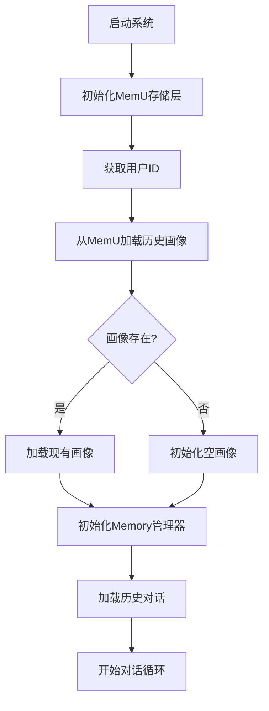
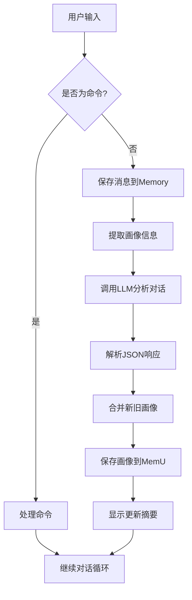
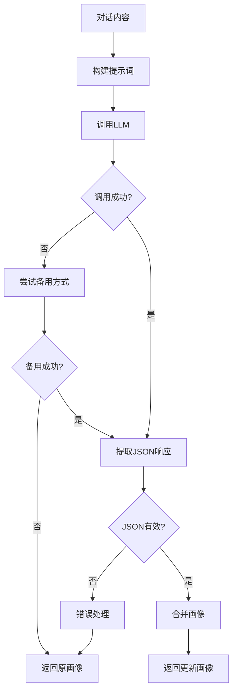

# 用户画像构建逻辑详解

## 项目概述

本项目是一个专门针对老年人的**用户画像提取系统**，通过分析对话内容，持续构建和完善用户的多维度画像。系统采用LLM（大语言模型）驱动的方式，从自然语言对话中智能提取结构化的用户信息。

## 核心设计理念

### 1. 证据驱动的画像构建
- **证据优先原则**：所有画像更新必须基于对话中的明确证据
- **避免推测**：不基于常识、刻板印象或模型偏好填充信息
- **置信度量化**：每个字段都有0.0-1.0的置信度评分

### 2. 渐进式画像完善
- **增量更新**：新对话只更新有新证据的字段，保留原有信息
- **冲突处理**：新信息与旧画像冲突时，优先采用更明确、更近期的证据
- **时间敏感性**：优先更新为用户的当前状态

### 3. 老年用户特化设计
- **语言容错**：处理方言、口语、省略、代词模糊等老年人表达特点
- **情感理解**：识别情绪化表达和叙述跳跃
- **健康关注**：重点关注健康状况、认知能力、生活方式等维度

## 画像结构设计

### 整体架构

用户画像采用**6个维度**的结构化设计，每个维度包含多个具体字段：

```
用户画像
├── demographics (人口统计信息)
├── health (健康状况)
├── cognitive (认知能力)
├── emotional (情感状态)
├── lifestyle (生活方式)
└── preferences (偏好设置)
```

### 字段值结构

每个字段都采用统一的`FieldValue`结构：

```json
{
  "value": "具体值或null",
  "confidence": 0.8  // 置信度 0.0-1.0
}
```

### 详细维度说明

#### 1. Demographics (人口统计信息)
```python
{
  "age": {"value": 68, "confidence": 0.9},           # 年龄
  "gender": {"value": "男", "confidence": 0.8},       # 性别
  "city_level": {"value": "石家庄", "confidence": 0.9}, # 城市/地区
  "education": {"value": "高中", "confidence": 0.7},   # 教育程度
  "marital_status": {"value": "已婚", "confidence": 0.8} # 婚姻状况
}
```

#### 2. Health (健康状况)
```python
{
  "chronic_conditions": {"value": ["高血压", "糖尿病"], "confidence": 0.9}, # 慢性病列表
  "mobility": {"value": "良好", "confidence": 0.7},                    # 行动能力
  "sleep_quality": {"value": "一般", "confidence": 0.6},               # 睡眠质量
  "medication_adherence": {"value": "规律服药", "confidence": 0.8}      # 用药情况
}
```

#### 3. Cognitive (认知能力)
```python
{
  "memory_status": {"value": "轻微健忘", "confidence": 0.6},        # 记忆状况
  "digital_literacy": {"value": "基础", "confidence": 0.7},        # 数字设备使用能力
  "expression_fluency": {"value": "流畅", "confidence": 0.8}       # 表达流畅度
}
```

#### 4. Emotional (情感状态)
```python
{
  "baseline_mood": {"value": "乐观", "confidence": 0.7},           # 基础情绪
  "loneliness_level": {"value": "偶尔", "confidence": 0.6},        # 孤独感程度
  "anxiety_level": {"value": "轻微", "confidence": 0.5}           # 焦虑程度
}
```

#### 5. Lifestyle (生活方式)
```python
{
  "living_arrangement": {"value": "与配偶同住", "confidence": 0.8},  # 居住安排
  "daily_routine": {"value": "规律作息", "confidence": 0.7},        # 日常作息
  "hobbies": {"value": ["太极", "下棋", "看电视"], "confidence": 0.8} # 兴趣爱好
}
```

#### 6. Preferences (偏好设置)
```python
{
  "communication_style": {"value": "温和耐心", "confidence": 0.7},      # 沟通风格
  "service_channel_preference": {"value": "电话", "confidence": 0.8},   # 服务渠道偏好
  "privacy_sensitivity": {"value": "中等", "confidence": 0.6}          # 隐私敏感度
}
```

## 技术实现架构

### 1. 数据模型层 (`profile_schema.py`)

使用**Pydantic 2.x**定义严格的数据结构：

```python
class FieldValue(BaseModel):
    """画像字段值结构"""
    value: Optional[Union[str, int, float, List[str]]] = None
    confidence: float = Field(default=0.0, ge=0.0, le=1.0)

class Demographics(BaseModel):
    """人口统计信息"""
    age: FieldValue = Field(default_factory=lambda: FieldValue())
    gender: FieldValue = Field(default_factory=lambda: FieldValue())
    # ... 其他字段
```

**设计优势**：
- 类型安全：Pydantic确保数据类型正确性
- 验证机制：自动验证置信度范围(0.0-1.0)
- 兼容性：提供字典转换方法兼容旧代码

### 2. 画像提取层 (`profile_extractor.py`)

#### LLM集成策略

支持**双重LLM调用方式**：
1. **LangChain方式**（推荐）：更灵活的LLM集成
2. **DashScope SDK直接调用**：轻量级备选方案

```python
def update_profile(conversation: str, profile: Dict[str, Any]) -> Dict[str, Any]:
    """
    从对话内容中提取用户画像信息并更新现有画像
    
    流程：
    1. 使用LLM从对话中提取画像信息
    2. 解析LLM返回的JSON
    3. 合并新旧画像（保留高置信度信息）
    4. 返回更新后的画像
    """
```

#### 提示词工程

采用**结构化提示词模板**，包含：

1. **角色定义**：老年用户画像结构化抽取引擎
2. **任务目标**：基于对话证据构建可信画像模型
3. **核心原则**：证据优先、显式优于隐式、不确定则不填等
4. **字段结构说明**：详细的6维度字段定义
5. **置信度评分规范**：0.0-1.0的评分标准
6. **语言容错规则**：处理老年人表达特点
7. **输出格式要求**：纯JSON输出

#### 画像合并策略

```python
def merge_profile(old_profile: Dict[str, Any], new_profile: Dict[str, Any]) -> Dict[str, Any]:
    """
    合并新旧画像，保留旧画像的结构，只更新有值的字段
    
    合并策略：
    - 对于包含value和confidence的字段：只有当新值置信度更高或旧值为None时才更新
    - 对于列表类型：合并去重
    - 对于嵌套字典：递归合并
    """
```

**合并规则**：
- **置信度优先**：新信息置信度更高时才更新
- **非空保护**：旧值为None时接受新值
- **列表合并**：兴趣爱好等列表字段进行去重合并
- **递归处理**：处理嵌套字典结构

### 3. 存储集成层 (`memory_store.py`)

与**MemU框架**深度集成：

```python
class MemUStore:
    """
    基于 memU 框架的记忆存储层
    
    功能：
    - 用户画像存储和加载（使用 document modality）
    - 对话历史存储（使用 conversation modality）
    - 记忆检索（用于个性化回答）
    - 多用户支持（通过 user_id 隔离）
    """
```

**存储策略**：
- **双重存储**：MemU + 本地JSON缓存
- **模态分离**：画像用document模态，对话用conversation模态
- **用户隔离**：通过user_id实现多用户支持
- **容错机制**：MemU失败时降级到本地缓存

### 4. 对话管理层 (`chat_memory.py`)

与**LangChain Memory**集成：

```python
class ChatMemoryManager:
    """
    LangChain Memory 管理器，与 memU 存储层同步
    
    功能：
    - 为每个用户创建独立的 Memory 实例
    - 自动从 memU 加载历史对话
    - 新增对话同步更新 Memory 和 memU
    - 支持 user/assistant/system 三种角色
    """
```

## 画像构建流程

### 1. 初始化流程



### 2. 对话处理流程



### 3. LLM画像提取流程



## 置信度评分体系

### 评分标准

| 置信度范围 | 证据类型 | 示例 |
|-----------|---------|------|
| 0.9 - 1.0 | 明确直接表达 | "我今年68岁"、"我有高血压" |
| 0.7 - 0.8 | 多次提及、语义清晰 | 多次谈到某个兴趣爱好 |
| 0.5 - 0.6 | 基于语气、行为的合理推断 | 从表达方式推断沟通风格 |
| 0.1 - 0.4 | 弱推断（慎用） | 基于年龄推断可能的健康状况 |
| 0.0 | 无信息或无法推断 | 对话中未涉及的信息 |

### 置信度更新规则

1. **新信息优先**：新证据置信度更高时更新
2. **证据累积**：多次提及相同信息时提高置信度
3. **时间衰减**：长时间未更新的信息可能降低置信度
4. **冲突处理**：冲突信息出现时降低置信度

## 错误处理与容错机制

### 1. API调用容错

```python
# 双重LLM调用策略
try:
    if LANGCHAIN_AVAILABLE:
        response_text = _call_llm_with_langchain(conversation, profile_json)
    else:
        response_text = _call_llm_with_dashscope(conversation, profile_json)
except Exception as e:
    # 尝试备用方式
    if LANGCHAIN_AVAILABLE and DASHSCOPE_SDK_AVAILABLE:
        response_text = _call_llm_with_dashscope(conversation, profile_json)
```

### 2. JSON解析容错

```python
def extract_json_from_text(text: str) -> Dict[str, Any]:
    """
    从文本中提取JSON，处理可能的markdown代码块或其他格式
    """
    # 1. 尝试直接解析
    # 2. 提取代码块中的JSON
    # 3. 提取第一个完整的JSON对象
```

### 3. 存储容错

- **双重存储**：MemU主存储 + 本地JSON缓存
- **降级策略**：MemU失败时自动使用本地缓存
- **数据恢复**：启动时优先从MemU加载，失败时使用缓存

### 4. 用户体验容错

- **非中断原则**：画像提取失败时返回原画像，不中断对话
- **详细错误提示**：API配置错误时提供具体的排查步骤
- **状态透明**：实时显示处理状态和结果

## 性能优化策略

### 1. 延迟初始化

```python
# LLM延迟初始化，避免启动时的不必要开销
llm = None
def init_llm():
    global llm
    if llm is None:
        llm = ChatTongyi(...)
```

### 2. 缓存机制

- **本地缓存**：JSON文件缓存用户画像和对话历史
- **Memory缓存**：LangChain Memory提供会话级缓存
- **MemU缓存**：利用MemU的内置缓存机制

### 3. 增量更新

- **字段级更新**：只更新有新证据的字段
- **置信度门槛**：低置信度信息不触发存储操作
- **批量操作**：多个字段变更时批量保存

## 扩展性设计

### 1. 维度扩展

通过修改`profile_schema.py`可以轻松添加新的画像维度：

```python
class NewDimension(BaseModel):
    """新维度"""
    new_field: FieldValue = Field(default_factory=lambda: FieldValue())

class UserProfile(BaseModel):
    # 现有维度...
    new_dimension: NewDimension = Field(default_factory=NewDimension)
```

### 2. LLM提供商扩展

支持添加新的LLM提供商：

```python
def _call_llm_with_new_provider(conversation: str, profile_json: str) -> str:
    """使用新LLM提供商"""
    # 实现新的调用逻辑
```

### 3. 存储后端扩展

通过MemU框架支持多种存储后端：
- PostgreSQL + pgvector
- SQLite
- 内存存储
- 其他向量数据库

## 使用示例

### 基本使用流程

```python
from profile_schema import init_profile
from profile_extractor import update_profile, check_api_key

# 1. 检查API配置
key_info = check_api_key()
print(key_info['message'])

# 2. 初始化空画像
profile = init_profile()

# 3. 从对话中提取画像
conversation = "你好，我是石家庄人，今年68岁了"
profile = update_profile(conversation, profile)

# 4. 查看更新后的画像
import json
print(json.dumps(profile, ensure_ascii=False, indent=2))
```

### 完整系统运行

```bash
cd main/code_new/
python agent.py
```

系统提供交互式对话界面：
- 输入对话内容自动提取画像
- `show` - 查看画像摘要
- `profile` - 查看完整画像JSON
- `exit` - 保存并退出

## 总结

本用户画像构建系统通过以下核心特性实现了高质量的老年用户画像构建：

1. **结构化设计**：6维度画像结构，覆盖用户的全方位信息
2. **证据驱动**：基于对话证据的可信画像构建，避免主观推测
3. **置信度量化**：每个字段都有置信度评分，支持不确定性表达
4. **渐进式完善**：增量更新机制，持续完善用户画像
5. **老年用户特化**：针对老年人表达特点的语言容错处理
6. **技术栈先进**：LLM+MemU+LangChain的现代化技术架构
7. **容错机制完善**：多层次的错误处理和降级策略
8. **扩展性良好**：支持维度扩展、LLM扩展、存储扩展

该系统可广泛应用于个人AI助手、健康管理、客户服务等场景，为老年用户提供个性化、智能化的服务体验。